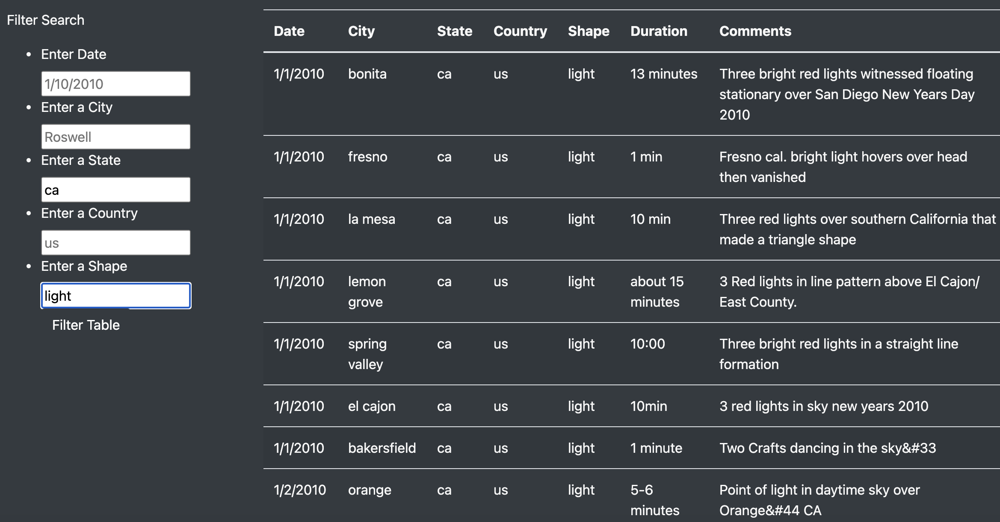

# UFOs

## Overview 

The purpose of this analysis was to evaluate recorded UFO sightings for a journalistic write up of these sightings for a group of enthusiasts. 

## Results 

Using a javascript file, a website was created to search for UFO sightings based on filter criteria of Date, City, State, Country, and Shape. Simply put the criteria that you would like to read in the filters on the left, and the table will update to reflect the relevant data. For example, here the table is filtered by state and shape: 

 

The table will update based on each filter, so each can be used individually or combined together as seen in the above example. 

## Summary, 

The one drawback of this data is that it does not visualize the aggregate data in order to understand overall trends. I would recommend a bar chart that shows number of sightings by location and also responds to the filters on the page. I would also recommend another bar chart that shows the shape of sighting by location in order to understand if there are commonalities that changes geographically. 
